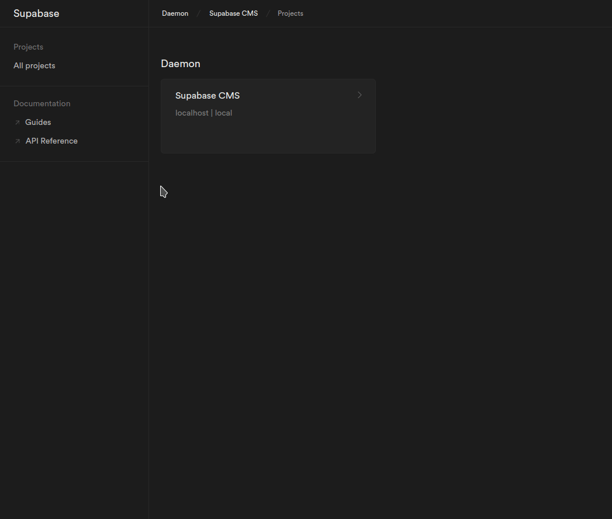

# Strapi Upload Provider for Supabase Storage

- This provider was based on Strapi's official [AWS S3 Provider](https://github.com/strapi/strapi/tree/master/packages/providers/upload-aws-s3) but adapted for [Supabase's Storage API](https://supabase.com/docs/guides/storage)

## Links 

- [Strapi website](https://strapi.io/)
- [Strapi documentation](https://docs.strapi.io/)
- [Strapi community on Discord](https://discord.strapi.io/)
- [Strapi news on Twitter](https://twitter.com/strapijs)

## Installation

```bash
# using yarn
yarn add strapi-provider-upload-supabase-storage

# using npm
npm install strapi-provider-upload-supabase-storage --save
```

## Configuration

- `provider` defines the name of the provider
- `providerOptions` is passed down during the construction of the provider. (ex: `supabase.createClient('apiUrl, apiKey, options)`). [Complete list of options](https://supabase.com/docs/reference/javascript/initializing)
- `actionOptions` is passed directly to the parameters to each method respectively. You can find the complete list of [upload/ uploadStream options](https://supabase.com/docs/reference/javascript/storage-from-upload). There are currently no options for [delete](https://supabase.com/docs/reference/javascript/storage-from-remove).

### Provider Configuration

`./config/plugins.js` or `./config/plugins.ts` for TypeScript projects:

```js
module.exports = ({ env }) => ({
  // ...
  upload: {
    config: {
        provider: 'strapi-provider-upload-supabase-storage',
        providerOptions: {
            apiKey: env('SUPABASE_API_KEY'),
            apiUrl: env('SUPABASE_API_URL'),
            bucket: {
                name: 'strapi-uploads',
                public: false
            },
        },
        actionOptions: {
            upload: {},
            uploadStream: {},
        },
    },
  },
  // ...
});
```

### Security Middleware Configuration

Due to the default settings in the Strapi Security Middleware you will need to modify the `contentSecurityPolicy` settings to properly see thumbnail previews in the Media Library. You should replace `strapi::security` string with the object bellow instead as explained in the [middleware configuration](https://docs.strapi.io/developer-docs/latest/setup-deployment-guides/configurations/required/middlewares.html#loading-order) documentation.

`./config/middlewares.js`

```js
module.exports = [
  // ...
  {
    name: 'strapi::security',
    config: {
      contentSecurityPolicy: {
        useDefaults: true,
        directives: {
          'connect-src': ["'self'", 'https:'],
          'img-src': [
            "'self'",
            'data:',
            'blob:',
            env('SUPABASE_API_URL'),
          ],
          'media-src': [
            "'self'",
            'data:',
            'blob:',
            env('SUPABASE_API_URL'),
          ],
          upgradeInsecureRequests: null,
        },
      },
    },
  },
  // ...
];
```

## Bucket Configuration

Although this plugin will create the bucket in Supabase Storage if it doesn't exist, it will be private by default if you didn't set providerOptions.bucket.public to true in the Provider Configuration. Therefore the Public Url returned to Strapi won't be accessible. You can solve  this by making the Bucket public in the Supabase Admin Portal, or giving it an appropriate [Security Policy](https://supabase.com/docs/guides/storage/access-control#policy-examples). 

I recommend adding the `Give users access to a folder only to authenticated users` template to your Bucket from the Supabase Admin Portal.
```sql
CREATE POLICY "policy_name"
ON storage.objects FOR {operation} {USING | WITH CHECK} (
    -- restrict bucket
    bucket_id = {bucket_name}
    AND (storage.foldername(name))[1] = 'private'
    AND auth.role() = 'authenticated'
);
```

